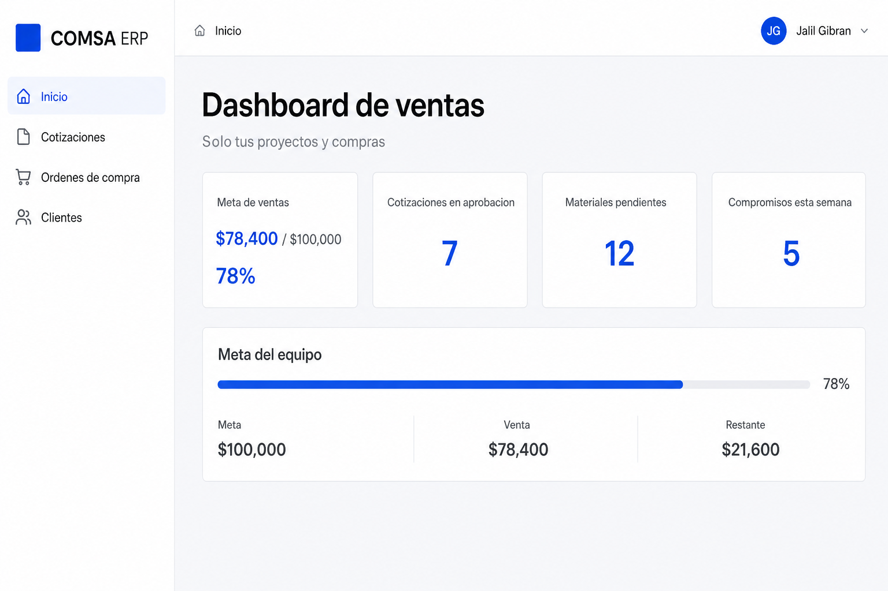
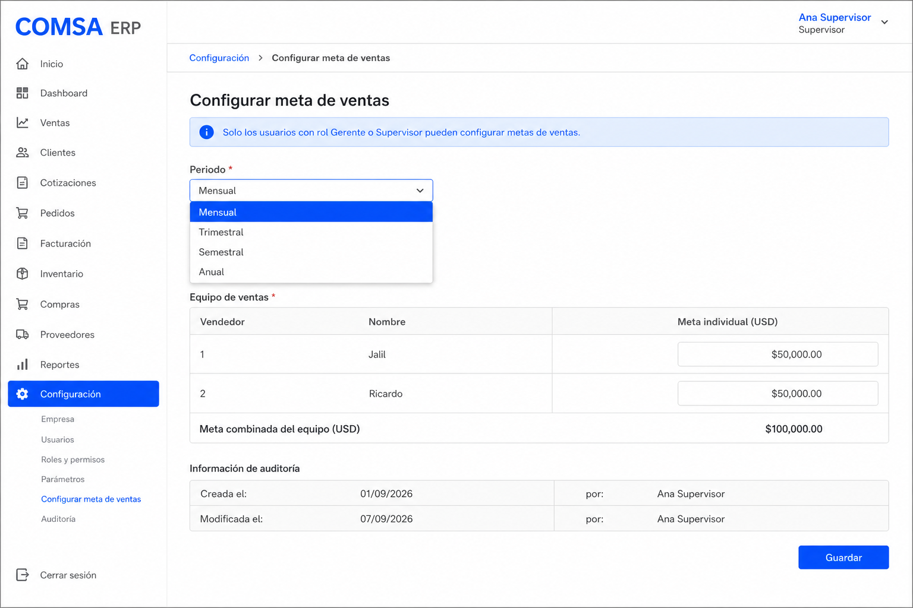
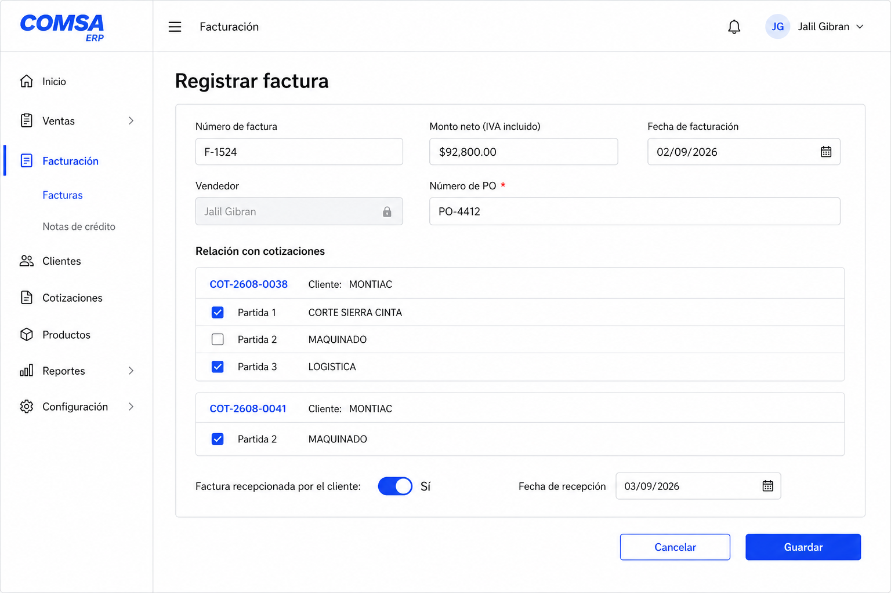
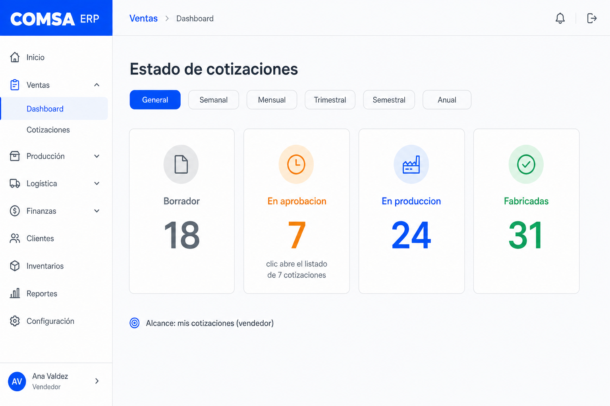
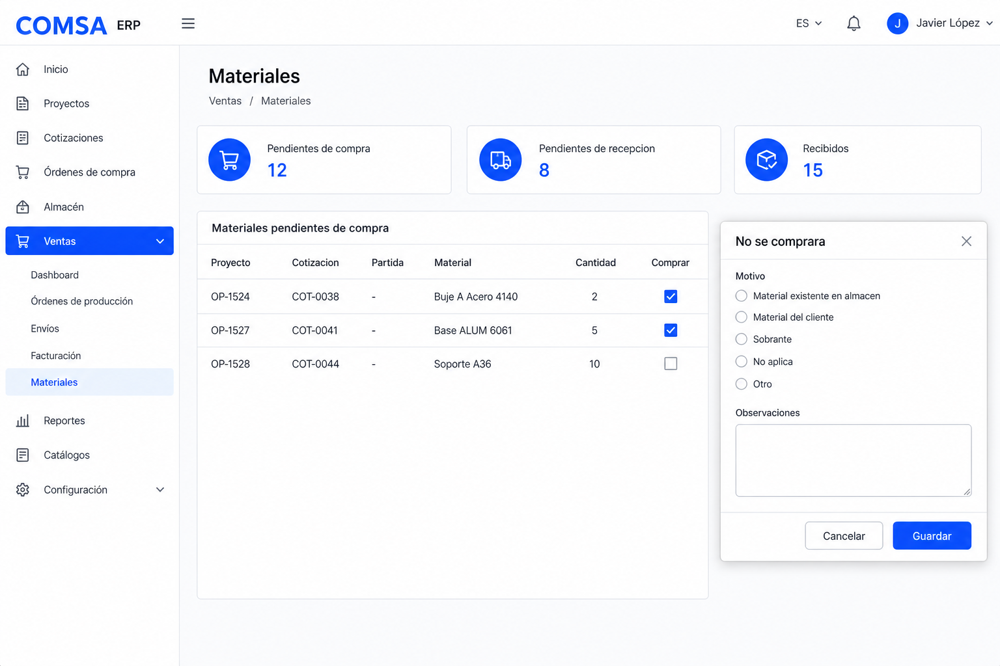
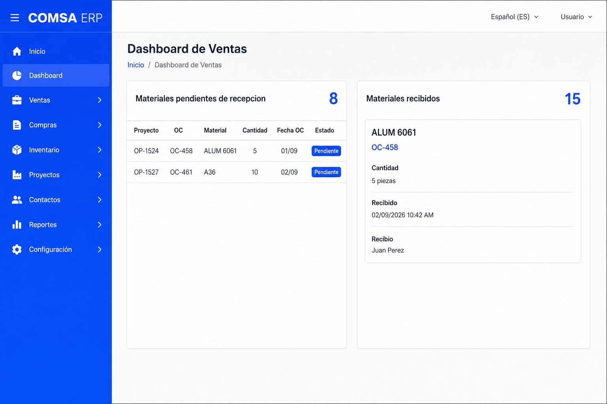
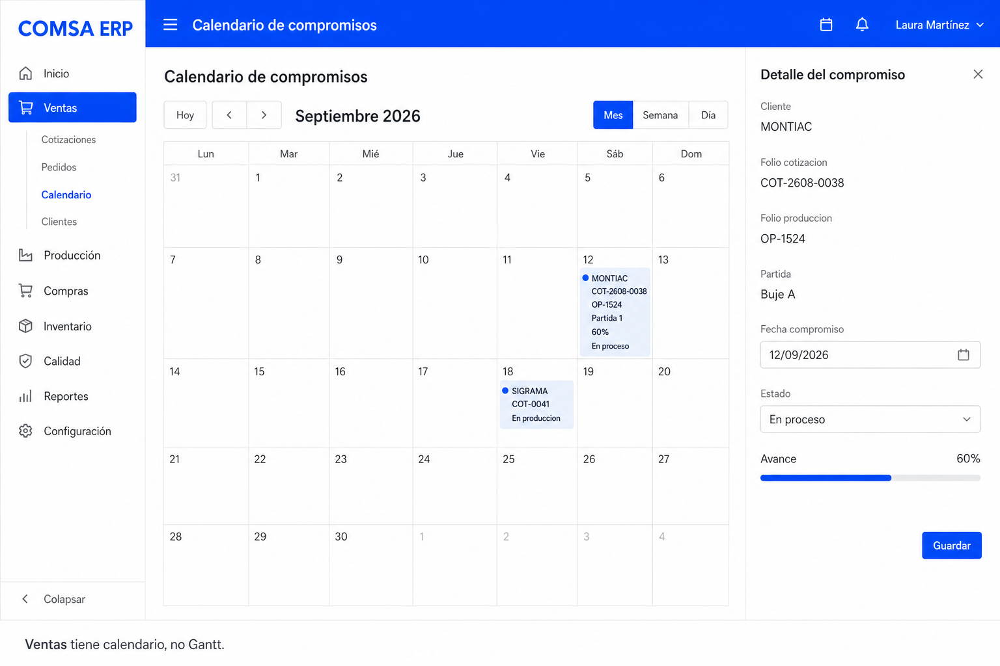

# Dashboard de Ventas — pantallas de KPI

**Fuente:** *MODIFICACION DE ERP 02.09.2026*  
**Fecha:** 7 de septiembre de 2026  
**Estado:** implementado en el ERP (`/ventas`, APIs `/api/ventas/*`).  
El PDF de orden de compra **sí quedó** en formato `COM-ALM-R-01`.

Este documento junta un pantallazo por cada bloque de KPI de la propuesta original.

---

## 0. Home del vendedor (alcance de menú)

La presentación marca la pantalla principal de un vendedor: **solo información de ventas y crear órdenes de compra**. El resto de KPIs actuales (usuarios, almacenes, inventario, producción global) **no se muestran**.

El recuadro vacío del home actual es donde van estos KPI.



**Menú visible para el rol Ventas**

- Inicio (este dashboard)
- Cotizaciones
- Órdenes de compra
- Clientes

**No visible:** usuarios, roles, almacenes, inventario, bitácora, catálogos de planta, Gantt de producción.

Los datos se calculan solos desde Cotizaciones, Producción, Compras y Almacén. Sin captura manual de indicadores.

---

## 1. KPI — Meta de ventas

Objetivo: avance del equipo comercial contra una meta del periodo.

Debe verse:

| Dato | Ejemplo en el mockup |
| --- | --- |
| Meta establecida | $100,000 (equipo: vendedor 1 + vendedor 2) |
| Venta acumulada | $78,400 |
| % de cumplimiento | 78% |
| Monto restante | $21,600 |
| Barra de progreso | visual |

La meta es **por equipo de ventas**, no por persona aislada (ejemplo de la presentación: vendedor 1 + vendedor 2 = $100,000).


### 1.1 Configuración de la meta

Solo **Gerente de Ventas** o **Supervisor de Ventas**. Periodos: mensual, trimestral, semestral, anual.

Cada meta guarda: monto, periodo, fecha de creación, quien la creó, fecha de modificación, quien la modificó.



### 1.2 Alimentar el KPI: registro de factura

El vendedor puede cargar facturas; el vendedor de la factura queda **fijo como el usuario en sesión**. Gerente/Supervisor sí puede elegir vendedor. La carga por vendedor es opcional; supervisor/gerente siempre puede hacerlo.

Campos obligatorios:

1. Número de factura — único en sistema **y** en base de datos (no solo en pantalla).
2. Monto neto — total **con IVA**.
3. Fecha de facturación.
4. Vendedor — automático si captura un vendedor; seleccionable si captura un gerente/supervisor.
5. Número de PO del cliente — obligatorio. Cadena: Cliente → PO → Cotización → Partida → Factura.

Relación con cotizaciones: una factura puede ligarse a **varias cotizaciones**, y en cada una se marcan partidas con checkbox.

Ejemplo de la presentación:

```
FACTURA F-1524
├── COT-2608-0038  (MONTIAC)
│   ├── Partida 1  ☑  CORTE SIERRA CINTA
│   ├── Partida 2  ☐  MAQUINADO
│   └── Partida 3  ☑  LOGÍSTICA
└── COT-2608-0041
    └── Partida 2  ☑
```

Recepción por el cliente:

- ¿Recepcionada? No / Sí (obligatorio).
- Si **No**: entra al reporte de facturas sin recepcionar.
- Si **Sí**: pide **fecha de recepción** (ejemplo: facturación 02/09/2026, recepción 03/09/2026). De ahí salen días de crédito / fecha esperada de pago cuando exista ese módulo.



---

## 2. KPI — Estado de cotizaciones

Conteo por etapa, **solo las del vendedor** en sesión. Supervisor/Gerente puede ver las suyas, las de un vendedor, o las de todo el equipo.

| Estado | Significado | Ejemplo |
| --- | --- | ---: |
| Borrador | En elaboración | 18 |
| En aprobación | Terminadas por ventas, pendientes de autorización | 7 |
| En producción | Aprobadas con OP activa | 24 |
| Fabricadas | OP ya terminada | 31 |

Vistas de periodo: **general, semanal, mensual, trimestral, semestral, anual**.

Cada número es un **acceso directo**: clic en “7 En aprobación” abre el listado de esas 7 cotizaciones.



---

## 3. KPI — Materiales y compras de mis proyectos

Tres indicadores, solo proyectos **vendidos y en producción** del vendedor.

### 3.1 Pendientes de compra

Materiales de partidas en cotizaciones **Aprobada → En producción** que todavía no tienen compra.

Columnas: Proyecto, Cotización, Partida, Material, Cantidad, ¿Comprar?

Checkbox:

- ☑ Se comprará
- ☐ No se comprará → obliga **razón** (existente en almacén / cliente lo aporta / sobrante / no aplica / otro) y **observaciones**.



### 3.2 Pendientes de recepción

Solo si: ya están en una OC, la OC es de un proyecto del vendedor, y almacén **aún no recepcionó**.

Columnas: Proyecto, OC, Material, Cantidad, Fecha OC, Estado.

Se actualiza solo cuando almacén registra la recepción.

### 3.3 Recibidos / arribados

Cada recepción conserva: material, cantidad, OC, proyecto, partida, fecha, hora, usuario que recibió.



---

## 4. Calendario de compromisos

No es el Gantt de producción.

| Módulo | Calendario | Gantt |
| --- | --- | --- |
| Ventas | Sí | No |
| Producción | Sí | Sí |

Muestra solo proyectos del vendedor: cliente, folio cotización, folio producción, partida, descripción, fecha compromiso, estado de producción, avance.

**Cálculo de fecha compromiso** (cuando pasa Aprobada → En producción):

```
Cotización aprobada  02/09/2026
        ↓
En producción        02/09/2026
        ↓
Tiempo de entrega cotizado   10 días hábiles COMSA
        ↓
Fecha compromiso     12/09/2026
```

Ventas autorizada puede **editar** esa fecha. Esa fecha única alimenta calendario de ventas, Gantt de producción y calendario de producción.



---

## Inventario de pantallas

| # | Archivo | Qué cubre de la presentación |
| ---: | --- | --- |
| 1 | `kpis-ventas/01-dashboard-vendedor.png` | Home vendedor + KPI 1 (meta y barra) |
| 2 | `kpis-ventas/06-configurar-meta.png` | Configuración de meta (gerente/supervisor) |
| 3 | `kpis-ventas/02-registro-factura.png` | Factura, cotizaciones/partidas, PO, recepción |
| 4 | `kpis-ventas/03-estado-cotizaciones.png` | KPI 2 + filtros de periodo |
| 5 | `kpis-ventas/04-materiales-pendientes-compra.png` | KPI 3.1 + modal “no se comprará” |
| 6 | `kpis-ventas/07-recepcion-y-recibidos.png` | KPI 3.2 y 3.3 |
| 7 | `kpis-ventas/05-calendario-compromisos.png` | Calendario de compromisos |

Imágenes en `docs/kpis-ventas/`. Para PDF: abrir este markdown en el visor o copiar a Google Docs.

---

## Fuera de este documento (ya resuelto)

El punto 2 de la presentación (“el PDF de orden de compra aún no está creado”) **ya está implementado**: formato controlado `COM-ALM-R-01`, revisión 1.1, export desde el detalle de la OC (`/api/ordenes-compra/[id]/pdf`).
